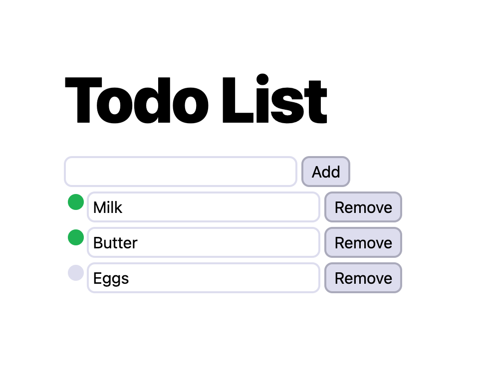

# Bloom (legacy)

This project is being replaced! Stay tuned.

Bloom is a small toolkit for manipulating the DOM, with a focus on creative coding and animation. It allows you to declaratively create DOM elements with reactive behavior using streams.

Reactive updates only change the dependent part of the DOM with no diffing needed. This means reactive values can be animated in real-time without any overhead.

## Usage

The recommended way to install is through a CDN, so no bundler is required.

```js
import * as bloom from "https://cdn.skypack.dev/bloom";
```

You'll also need a stream library, specifically [S](https://github.com/adamhaile/S), and [SArray](https://github.com/adamhaile/S-array).

```js
import S from "https://cdn.skypack.dev/s-js";
import SArray from "https://cdn.skypack.dev/s-array";
```

## API

### Create

`create(data: string | object): Node`

Creates a new `Node`. Pass a string to create a text node.

```js
create("Hello");
// #text "Hello"
```

Pass an object to create an element. Creates a div by default.

```js
create({});
// <div></div>
```

Create an element with attributes:

```js
create({
  tag: "a",
  href: "/",
  hidden: true,
  style: { opacity: 0.5 },
  classList: ["class-1", "class-2"],
  children: "Link",
  onClick: console.log,
});
// <a href="/" hidden style="opacity: 0.5;" class="class-1 class-2">Link</a>
```

Create children:

```js
create({ tag: "ul", children: [
  { tag: "li" children: "Alpha" },
  { tag: "li" children: "Bravo" },
  { tag: "li" children: "Charlie" },
]})
/*
  <ul>
    <li>Alpha</li>
    <li>Bravo</li>
    <li>Charlie</li>
  </ul>
*/
```

`create` accepts other `Nodes` for `children`.

```js
create({ children: create({ children: create("Hello") }) });
// <div><div>Hello</div></div>
```

Reactive attributes:

```js
const isHidden = S.data(false);
const element = create({ hidden: isHidden });
console.log(element);
// <div></div>
isHidden(true);
console.log(element);
// <div hidden></div>
```

Reactive child:

```js
const isToggled = S.data(false);
const element = create({ children: S(() => (isToggled() ? "On" : "Off")) });
console.log(element);
// <div>Off</div>
isToggled(true);
console.log(element);
// <div>On</div>
```

Child nodes will be updated instead of replaced when possible, using `patch` internally (see below). Reactive child arrays can be declared using [SArray](https://github.com/adamhaile/S-array):

```js
const items = SArray([]);
const element = create({
  tag: "ul",
  children: items.map((text) => ({
    tag: "li",
    children: text,
  })),
});
console.log(element);
// <ul></ul>
items.push("Alpha");
items.push("Bravo");
items.push("Charlie");
console.log(element);
/*
  <ul>
    <li>Alpha</li>
    <li>Bravo</li>
    <li>Charlie</li>
  </ul>
*/
items.reverse();
console.log(element);
/*
  <ul>
    <li>Charlie</li>
    <li>Bravo</li>
    <li>Alpha</li>
  </ul>
*/
```

### Assign

`assign(element: Element, props: object): Element`

Assigns properties to an existing element. Creating an element and then assigning props to it with `assign` is equivalent to creating the element with props using `create`.

```js
const props = {
  hidden: S.data(true),
  style: { opacity: 0.5 },
  classList: ["class-1", "class-2"],
};
const a = create({});
assign(a, props);
const b = create(props);
console.log(a.isEqualNode(b));
// true
```

### Patch

`patch(parent: Element, data: any, current: Node | Array<Node>): Element`

Intelligently replaces the child nodes of `parent` with `Nodes` to match `data`. Create new children by passing an array:

```js
const data = [
  { tag: "li", children: "Alpha" },
  { tag: "li", children: "Bravo" },
  { tag: "li", children: "Charlie" },
];
const a = create({ tag: "ul" });
const b = patch(a, data);
console.log(a.isSameNode(b));
// true
console.log(b);
/*
  <li>Alpha</li>
  <li>Bravo</li>
  <li>Charlie</li>
*/
```

`patch` returns a `Node` or `Node` array representing the new children of `parent`. If `parent` already has children, they will be updated—not replaced—if possible.

```js
const a = create({ children: "On" });
const b = a.firstChild;
const c = patch(a, "Off");
const d = c.firstChild;
console.log(b.isSameNode(d));
// true
```

Patching `undefined`, a `boolean`, an empty array, or `null` will result in a placeholder `Comment` node.

```js
const element = create({ children: "Hello" });
patch(element, []);
console.log(element);
//<div><!--[]--></div>
```

`patch` accepts a third argument, `current`. If present, it will only patch over those nodes, and return just the children that were patched.

```js
const element = create({ children: ["Alpha", "Charlie"] });
console.log(element);
/*
  <div>
    #text Alpha
    #text Charlie
  </div>
*/
patch(element, ["Bravo", "Charlie"], element.lastChild());
console.log(element);
/*
  <div>
    #text Alpha
    #text Bravo
    #text Charlie
  </div>
*/
```

Use S and SArray to patch reactively. When updating it will remember the nodes it created last and pass them as the `current` argument.

```js
const items = SArray([]);
const placeholder = create({});
const element = create({
  children: [
    { tag: "span", children: "First node" },
    placeholder,
    { tag: "span", children: "Last node" },
  ],
});
patch(
  element,
  items.map((text) => ({ tag: "span", children: text })),
  placeholder
);
console.log(element);
/*
  <div>
    <span>First node</span>
    <!--[]-->
    <span>Last node</span>
  </div>
*/
items.push("Alpha");
items.push("Bravo");
items.push("Charlie");
console.log(element);
/*
  <div>
    <span>First node</span>
    <span>Alpha</span>
    <span>Bravo</span>
    <span>Charlie</span>
    <span>Last node</span>
  </div>
*/
```

## Examples

### [Todos](./examples/todo.html)



Adapted from the [Surplus](https://github.com/adamhaile/surplus) simple todos example.

```js
import { patch } from "https://cdn.skypack.dev/bloom";
import S from "https://cdn.skypack.dev/s-js";
import SArray from "https://cdn.skypack.dev/s-array";

S.root(() => {
  const todos = SArray([]);
  const inputText = S.data("");
  const addTodo = () => {
    todos.push({ title: S.data(inputText()), done: S.data(false) });
    inputText("");
  };

  const Main = {
    tag: "main",
    children: [
      { tag: "h1", children: "Todo List" },
      {
        children: [
          {
            tag: "input",
            type: "text",
            onInput: (event) => void inputText(event.target.value),
            value: inputText,
          },
          { tag: "button", onClick: addTodo, children: "Add" },
        ],
      },
      todos.map((todo) => ({
        children: [
          {
            tag: "input",
            type: "checkbox",
            onInput: (event) => void todo.done(!todo.done()),
            checked: todo.done,
          },
          {
            tag: "input",
            type: "text",
            onInput: (event) => void todo.title(event.target.value),
            value: todo.title,
          },
          {
            tag: "button",
            onClick: () => todos.remove(todo),
            children: "Remove",
          },
        ],
      })),
    ],
  };

  patch(document.body, Main);
});
```

### [Kinetic typography](./examples/oscillate.html)


```js
import { patch } from "https://cdn.skypack.dev/bloom";
import { time } from "https://cdn.skypack.dev/bloom/utils.js";
import S from "https://cdn.skypack.dev/s-js";

const text = "OSCILLATE";
const iterations = 20;
const colorRange = 180;
const colorOffset = 1;
const speed = 0.002;
const height = 50;
const spread = 5;
const range = (n) => [...Array(n).keys()];

S.root(() => {
  const Trail = (char, i) => {
    return range(iterations).map((j) => {
      const p = j / iterations;
      const h = (colorOffset + p) * colorRange;
      const l = p * 100;
      const transform = S(() => {
        const y = Math.sin(time() * speed + p * spread + i) * height;
        return `translateY(${y}%)`;
      });
      return {
        tag: "span",
        children: char,
        style: {
          color: `hsl(${h}deg, 50%, ${l}%)`,
          transform,
        },
      };
    });
  };

  const Main = {
    tag: "main",
    children: text.split("").map((char, i) => ({
      tag: "span",
      children: Trail(char, i),
    })),
  };

  patch(document.body, Main);
});
```

### [Animated gallery](./examples/gallery.html)


```js
import { create, patch } from "https://cdn.skypack.dev/bloom";
import { mouse, time } from "https://cdn.skypack.dev/bloom/utils.js";
import S from "https://cdn.skypack.dev/s-js";

const fitRect = (rect, target) => {
  // ...
};

const items = [
  // ...
];

const Crossfade = ({ activeKey, children, ...other }) => {
  const container = create(other);
  const childMap = new Map(
    children.map(({ key, ...child }) => [key, create(child)])
  );
  S.on(activeKey, () => {
    if (activeKey()) {
      const child = childMap.get(activeKey()).cloneNode();
      container.appendChild(child);
      const animation = child.animate([{ opacity: 0 }, { opacity: 1 }], {
        duration: 200,
      });
      animation.onfinish = () => {
        let c = container.firstChild;
        while (c instanceof Node && c !== child) {
          container.removeChild(c);
          c = container.firstChild;
        }
      };
    }
  });
  return container;
};

const Transform = ({ translate, scale, style, children, ...other }) => {
  return {
    ...other,
    style: {
      ...style,
      transform: S(() =>
        "".concat(
          `translate(${translate()[0]}px, ${translate()[1]}px)`,
          `translate(-50%, -50%)`,
          `scale(${scale()[0]}, ${scale()[1]})`
        )
      ),
    },
    children,
  };
};

S.root(() => {
  const images = items.map((item) => {
    const rect = fitRect([0, 0, 1, item.image.aspectRatio], [0, 0, 1, 1]);
    return { rect, ...item.image, isActive: S.data(false) };
  });
  const activeImage = S(() => images.find((image) => image.isActive()));
  const containerScale = S.on(
    time,
    ([w, h]) => {
      const c = 0.2;
      const [, , wt, ht] = activeImage() ? activeImage().rect : [0, 0, 1.5, 0];
      return [w + (wt - w) * c, h + (ht - h) * c];
    },
    [1.5, 0]
  );

  const Main = {
    tag: "main",
    children: [
      Transform({
        classList: "image-container",
        translate: mouse,
        scale: containerScale,
        children: Crossfade({
          activeKey: S(() => (activeImage() ? activeImage().src : undefined)),
          children: images.map(({ src, isActive }) => ({
            tag: "img",
            key: src,
            src,
            classList: "image",
          })),
        }),
      }),
      items.map(({ title }, i) => ({
        tag: "a",
        onmouseenter: () => {
          images[i].isActive(true);
        },
        onmouseleave: () => images[i].isActive(false),
        classList: "link",
        children: title,
      })),
    ],
  };

  patch(document.body, Main);
});
```

## FAQ

### I prefer HyperScript-like syntax, so...?

If you don't like writing object literal notation, you can create your own [HyperScript](https://github.com/hyperhype/hyperscript) inspired element factory.

```js
function h(tag, ...children) {
  return create({ tag, children });
}
const view = h("ul", h("li", "Alpha"), h("li", "Bravo"), h("li", "Charlie"));
console.log(view);
/*
  <ul>
    <li>Alpha</li>
    <li>Bravo</li>
    <li>Charlie</li>
  </ul>
*/
```

Alternatively, you can create a factory for each tag name.

```js
const tagNames = [
  // ...
];
const elements = Object.fromEntries(
  tagNames.map((tag) => [tag, (...children) => create({ tag, children })])
);
const view = ul(li("Alpha"), li("Bravo"), li("Charlie"));
console.log(view);
/*
  <ul>
    <li>Alpha</li>
    <li>Bravo</li>
    <li>Charlie</li>
  </ul>
*/
```

## Coming soon

- Testing
- More FAQs
- More utils
- Bring your own stream library
- Declare [three.js](https://threejs.org/) scene graph as part of the object tree
- Tools for automatically attaching reactive behavior to an existing document
- Serialization

## Acknowledgements

- Adam Haile, [S](https://github.com/adamhaile/S), and [Surplus](https://github.com/adamhaile/surplus)
- Freak13's [Stage0](https://github.com/Freak613/stage0)
- [Composing Reactive Animations](http://conal.net/fran/tutorial.htm)
- [SolidJS: Reactivity to Rendering](https://indepth.dev/posts/1289/solidjs-reactivity-to-rendering)
- [The Misunderstood Roots of FRP Can Save Programming](https://futureofcoding.org/essays/dctp)
